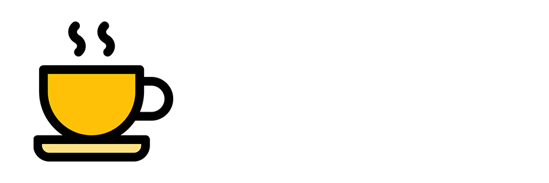
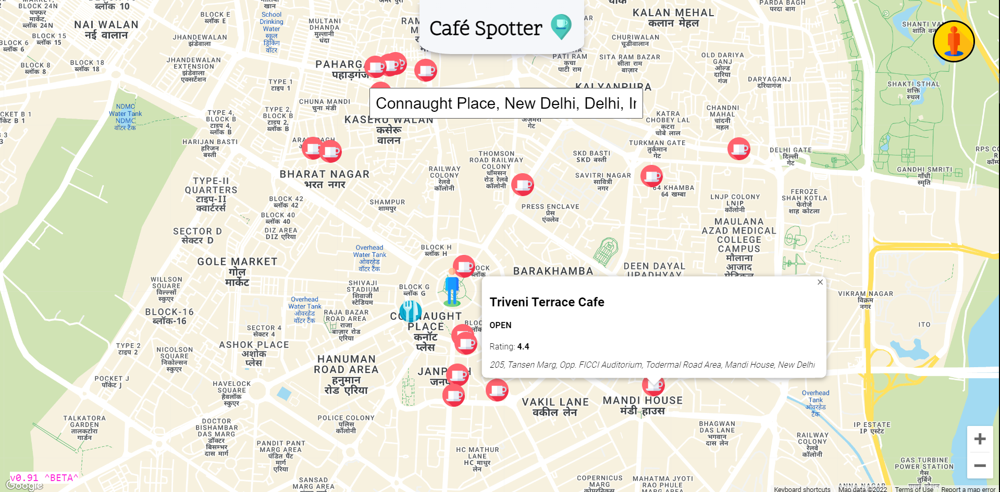
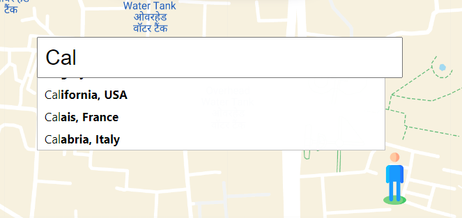
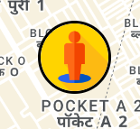
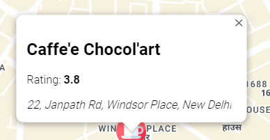

[![Contributors][contributors-shield]][contributors-url]
[![Forks][forks-shield]][forks-url]
[![Stargazers][stars-shield]][stars-url]
[![Issues][issues-shield]][issues-url]
[![LinkedIn][linkedin-shield]][linkedin-url]

<div align="center">
<h1 style="font-size: 5rem">Café Spotter</h1>

Love Coffee? Want to find cafés and restaurants near you quickly? Use Café Spotter to do so.


</div>

## Demo

A demp of this project can be found on this [link](https://cafe-spotter.vercel.app/)

<br/>

## Built With
- [ReactJS](https://reactjs.org/)
- [Google Maps API](https://developers.google.com/maps)
- [Google Place AutoComplete](https://developers.google.com/maps/documentation/places/web-service/autocomplete)

<br/>

# Getting Started

## Prerequisites

- npm
```
npm install npm@latest -g
```

## Installation

1. Clone the repository to your local machine.

```
git clone https://github.com/sahil9510/cafe-spotter.git
```

2. Install the required dependencies. (Make sure you have node or yarn installed)

```
npm install
```

3. Get your API Key from [here](https://developers.google.com/maps)

4. Enter your key in `.env.local`

```js
REACT_APP_API= `Your Key Here`
```

5.Runs the app in the development mode.\
```
Open http://localhost:3000 to view it in the browser.
```

# Usage

Use this app to find the nearest local cafes, bars and restaurants at any location.

## Screenshots

<br/>

### On Load Window

<br/>

<div style="text-align: left;">
<h3 style="display:inline-block">Search any place you want to</h3>



</div>


<div >
<h3 style="display:inline-block">Or go to your location</h3>



</div>

<div style=>


<h3 style="display:inline-block">Know about the place before visiting</h3>

</div>


# Contact
Sahil Srivastava - [@srivastv_Sahil](https://twitter.com/srivastv_Sahil) - [srivastavasahil133@gmail.com](mailto:srivastavasahil133@gmail.com)

Project Link: [github.com/sahil9510/cafe-spotter.git](https://github.com/sahil9510/cafe-spotter.git)


[contributors-shield]: https://img.shields.io/github/contributors/sahil9510/cafe-spotter.svg?style=for-the-badge
[contributors-url]: https://github.com/sahil9510/cafe-spotter/graphs/contributors
[forks-shield]: https://img.shields.io/github/forks/sahil9510/cafe-spotter.svg?style=for-the-badge
[forks-url]: https://github.com/sahil9510/cafe-spotter/network/members
[stars-shield]: https://img.shields.io/github/stars/sahil9510/cafe-spotter.svg?style=for-the-badge
[stars-url]: https://github.com/sahil9510/cafe-spotter/stargazers
[issues-shield]: https://img.shields.io/github/issues/sahil9510/cafe-spotter.svg?style=for-the-badge
[issues-url]: https://github.com/sahil9510/cafe-spotter/issues
[linkedin-shield]: https://img.shields.io/badge/-LinkedIn-black.svg?style=for-the-badge&logo=linkedin&colorB=555
[linkedin-url]: https://www.linkedin.com/in/sahil-srivastava-1a0564138/